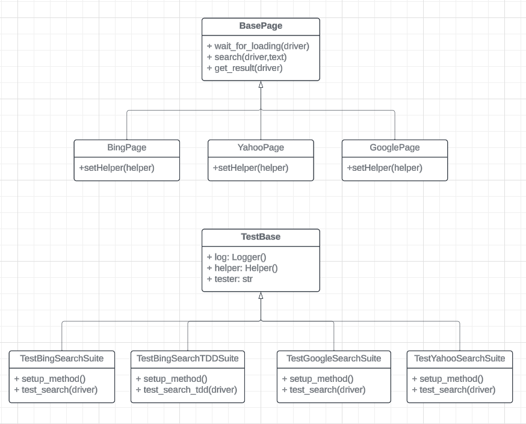

# Automation Framework

Simple automation framework structure (with search 
example) with implementation of abstraction and 
object-oriented programming following best practices.

## Setup

If you are using PyCharm, simply make a new Python project,
and it will automatically include the latest stable python
version with required packages. Otherwise, if you are using 
other IDEs, make sure that you have the following prerequisites installed:
- Python 3.x
- pip

#### Virtual environment
If your code editor already has an environment activated then you are good to go otherwise follow these commands:

1. This will create a new environment with name venv
On a powershell window:
```
 .\venv\Scripts\Activate.ps1
```
On a command line terminal:
```
venv\Scripts\activate
```
On a linux\macos terminal:
```
source venv/bin/activate
```
2. This will activate the environment:
```
python -m venv venv
```
#### Python packages:
Install the required with help of PyCharm package 
manager, or you can use the following bash command:
```bash
pip install -r requirements.txt
```
Now you are good to go.
## Running Tests
Before running tests, we should know that every file or test case should
start with 'test_'. This is done so that PyTest can collect all the required 
tests effectively.

In PyCharm, you can click on the play button to run the test. For 
bash, run tests using following command.

For a single file:
```bash
 pytest .\tests\testBingSearch\test_bing_search.py --browser=<browser-name>
```
For all files in the directory:
```bash
 pytest .\tests\testBingSearch\ --browser=<browser-name>
```
or for all directories:
```bash
 pytest .\tests\ --browser=<browser-name>
```
If you want to run tests parally we can use the following command:
```
pytest -n=3 .\tests\testGoogleSearch\ --browser=chrome
```
For more clean output and information use **-v**:
```
pytest -v .\tests\testGoogleSearch\ --browser=chrome
```
#### Note: 
Inside test_google_search.py, parameterization is implemented.
```
@pytest.mark.parametrize("search", k.SEARCHES)
```
#### Note: 
Hence, the same test_search method will be
executed 3 times for 3 different searches. While if you use the same command on Bing or Yahoo, it will run 
the 3 searches 3 times which will be 9 searches.

## Group Run Tests
Use pytest **-m** tag to group testcases:
```
pytest -m "sanity" .\tests\ 
```
or
```
pytest -m "sanity or regression" .\tests\ --browser=chrome
```

## HTML Report
To generate an HTML report for the tests, you can use the above commands with this **--html* extra command 
line parameter as follows:
```
pytest --html=reports\report.html .\tests\ --browser=chrome
```

## Allure Reporting
To use allure reports, Install allure from **allure official website** and add the **allure/bin/** 
to the environment path variable. To generate an Allure report for the tests, you can use the above 
commands with this **--alluredir** extra command line parameter as follows:
```
pytest --alluredir=.\reports\ .\tests\ --browser=chrome
```
When the test finishes, use the following command to generate the report:
```
allure serve .\reports\
```
To generate html report:
```
allure generate
```
This will create **allure-report** folder with required files.

Examples:
 
## Adding more browsers support

You can add more browser support by simpling adding the browser name and driver
under **driver fixture** method in **conftest.py** and that's it.

## Folder Structure

```
automationFramework
├── .venv
├── config
│   ├── config.ini
│   └── pytest.ini
├── logs
├── pages
│   ├── __init__.py
│   ├── bingPage
│   │   └── bing_page.py
│   ├── googlePage
│   │   └── google_page.py
│   ├── yahooPage
│   │   └── yahoo_page.py
│   └── base_page.py
├── reports
│   ├── assets
│   │   └── report.html
├── resources
│   ├── __init__.py
│   ├── constants.py
│   ├── helper.py
│   ├── logger.py
│   ├── read_config.py
│   └── xml_parser.py
├── testData
│   └── search_data.xlsx
├── tests
│   ├── testBingSearch
│   │   ├── test_bing_search.py
│   │   └── test_bing_search_tdd.py
│   ├── testGoogleSearch
│   │   └── test_google_search.py
│   ├── testYahooSearch
│   │   └── test_yahoo_search.py
│   └── test_base.py
├── .gitignore
├── conftest.py
├── img.png
├── README.MD
├── requirements.txt
└── run.bat


```
## Class Diagrams

